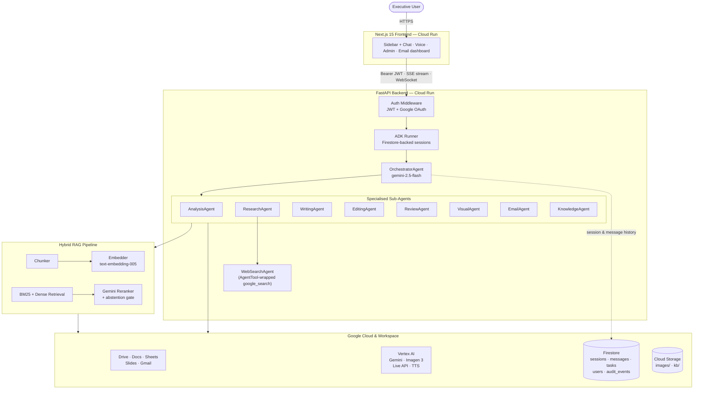
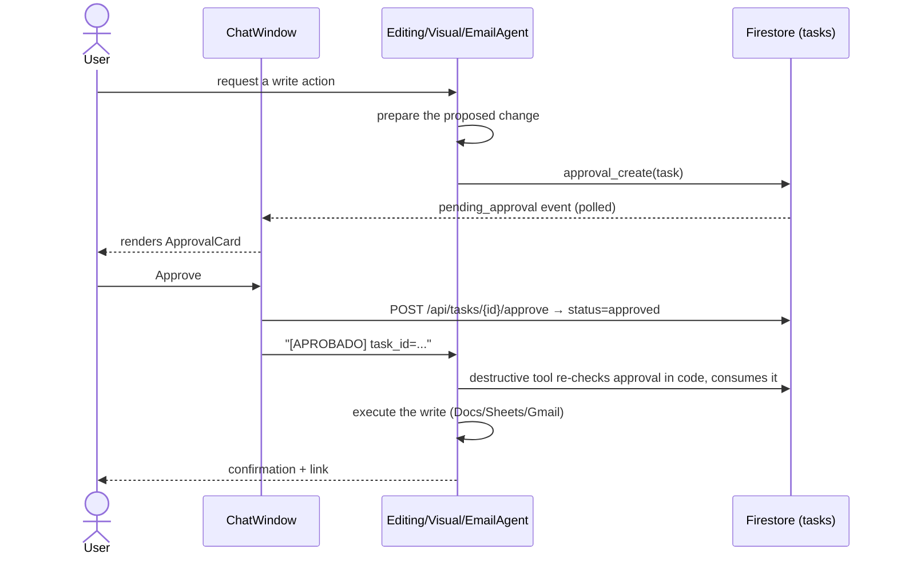

# Keralty Assistant

**A multi-agent executive AI assistant for Keralty**, built on Google's Agent Development Kit
(ADK). An orchestrator routes each request to one of eight specialised agents that work
directly with Google Workspace (Drive, Docs, Sheets, Slides, Gmail) and a corporate Knowledge
Base backed by a full hybrid RAG pipeline — all gated by human-in-the-loop approval before any
write action leaves the system.

Deployed on Google Cloud Run in the `keraltysandbox` GCP project (`us-central1`).

- **Live app:** `keralty-agent-frontend-569920970367.us-central1.run.app`
- **API:** `keralty-agent-backend-569920970367.us-central1.run.app`

---

## What it does

- **Chats like Claude.ai / ChatGPT** — a persistent sidebar with grouped conversation history
  (Hoy / Ayer / Últimos 7 días), instant switching between conversations, and a working "new
  conversation" that actually resets state.
- **Reads and writes Google Workspace** — creates and edits Docs, Sheets (including uploaded
  `.xlsx`/`.xls` files, not just native Google Sheets), and Slides, always behind an explicit
  approval step before anything is written.
- **Searches and reasons over a corporate Knowledge Base** — a hybrid BM25 + dense-embedding
  retrieval pipeline with Gemini reranking and an abstention gate, so the assistant says "I
  don't know" instead of guessing.
- **Manages email** — reads, triages, drafts, and sends via Gmail (approval-gated sends). The
  executive email dashboard shows AI-derived priority (not just Gmail's generic flags) on
  today's inbox, honestly reports when a fetch fails instead of showing false zeros, and
  generates a real, topic-aware follow-up draft — shown inline — with one click. "Today" is
  computed in the executive's own current timezone, wherever they're logged in from.
- **Voice input, and spoken replies on demand** — speak a request via the Gemini Live API, and
  click any reply to hear it read aloud with Gemini's own multilingual text-to-speech (not the
  browser's built-in voices, which are inconsistent and often mispronounce Spanish).
- **Generates images** — Imagen 3, downloadable directly from the chat.
- **Researches the web and internal documents together** — one agent that combines Google
  Search grounding with internal Drive search in a single response.
- **Gives admins visibility** — a panel for platform metrics, user management, Knowledge Base
  document management, and an audit trail of every write action.

---

## Architecture



### Human-in-the-loop approval flow

Every write to Google Workspace or every outbound email passes through the same approval
pattern before it executes:



The approval is enforced **server-side**, not by the prompt: each destructive tool
(`email_send`, `docs_update`, spreadsheet writes) verifies an approved, user-owned,
not-yet-consumed task before it runs and consumes it so one approval authorizes exactly one
action. The literal text `[APROBADO] task_id=...` alone — including from a prompt-injected
attachment — cannot trigger a send or write.

---

## Tech stack

| Layer | Technology |
|---|---|
| Agent orchestration | Google Agent Development Kit (ADK), Gemini 2.5 Flash/Pro |
| Backend | FastAPI, Python 3.11, Uvicorn |
| Frontend | Next.js 15 (App Router, Turbopack), TypeScript, Tailwind CSS v4 |
| AI models | Gemini 2.5 Flash/Pro, Gemini Live API, Gemini TTS, Imagen 3, text-embedding-005 |
| Retrieval | rank-bm25 (sparse) + Vertex AI embeddings (dense), Reciprocal Rank Fusion |
| Data | Firestore (sessions, messages, tasks, KB chunks, audit log), Cloud Storage |
| Auth | Google OAuth 2.0 (PKCE) + JWT (python-jose) |
| Hosting | Google Cloud Run (backend + frontend, separate services) |
| i18n | next-intl (Spanish default, English) |

---

## Getting started

### Prerequisites

- Python 3.11, Node.js 18+, Docker (for deployment builds)
- A GCP project with Firestore, Vertex AI, and the relevant Workspace APIs enabled
- OAuth 2.0 client credentials (Google Cloud Console)

### Backend

```bash
cd backend
python -m venv venv && source venv/bin/activate
pip install -r requirements.txt

cp ../.env.example .env   # fill in your own values

uvicorn main:app --host 0.0.0.0 --port 8000 --reload
curl http://localhost:8000/health
```

### Frontend

```bash
cd frontend
npm install
npm run dev   # http://localhost:3000
```

### Docker Compose (both services)

```bash
docker-compose up
```

Full environment variable reference: [`.env.example`](.env.example).

---

## Deployment

Both services deploy independently to Cloud Run as linux/amd64 Docker images:

```bash
# Backend
docker build --platform linux/amd64 \
  -t us-central1-docker.pkg.dev/keraltysandbox/cloud-run-source-deploy/keralty-agent-backend:TAG \
  ./backend
docker push us-central1-docker.pkg.dev/keraltysandbox/cloud-run-source-deploy/keralty-agent-backend:TAG
gcloud run services update keralty-agent-backend --image ...:TAG --region us-central1 --project keraltysandbox

# Frontend (NEXT_PUBLIC_API_URL is build-time, not runtime)
docker build --platform linux/amd64 \
  --build-arg NEXT_PUBLIC_API_URL=https://keralty-agent-backend-569920970367.us-central1.run.app \
  --build-arg NEXT_PUBLIC_ADMIN_ENABLED=true \
  -t us-central1-docker.pkg.dev/keraltysandbox/cloud-run-source-deploy/keralty-agent-frontend:TAG \
  ./frontend
docker push us-central1-docker.pkg.dev/keraltysandbox/cloud-run-source-deploy/keralty-agent-frontend:TAG
gcloud run services update keralty-agent-frontend --image ...:TAG --region us-central1 --project keraltysandbox
```

See [`CLAUDE.md`](CLAUDE.md) for the complete deployment reference, environment variables, and
GCP infrastructure inventory.

---

## Project structure

```
backend/
  agents/          Orchestrator + 8 specialised ADK agents
  routers/         FastAPI routes (auth, chat, email, history, admin, knowledge, voice, tts, tasks)
  tools/           ADK tool functions the agents call (Workspace, email, RAG, images)
  services/        Google API clients, Firestore access, and the RAG pipeline
  services/rag/    Chunking, embedding, retrieval, reranking
  auth/            OAuth flow + JWT middleware

frontend/
  app/[locale]/    Routed pages (chat, email, admin) — i18n via next-intl
  components/      Chat UI, layout (Sidebar/Navbar), document picker, approval cards
  hooks/           Shared client state (ChatSessionContext)

docs/              Product roadmap and use-case test scripts
branding/          Official Keralty brand assets (palette, logo, template)
```

---

## Documentation

- [`CLAUDE.md`](CLAUDE.md) — full developer/architecture reference (this is the canonical
  technical doc — keep it updated as the system changes)
- [`docs/product-roadmap-new-features.md`](docs/product-roadmap-new-features.md) — forward-looking
  roadmap for the next development cycle
- [`docs/use-cases-strategic-testing.md`](docs/use-cases-strategic-testing.md) — end-to-end test
  scenarios for every feature, written from an executive user's perspective

---

## Security & compliance notes

- **Authentication is required** for every request — a valid Google-OAuth-derived JWT. Missing,
  expired, or forged tokens are rejected with a hard `401`; there is no test/guest fallback
  identity, and the frontend shows an explicit sign-in screen when logged out.
- Every Workspace write and every outbound email requires explicit human approval, **enforced in
  code** (the destructive tool re-verifies an approved, user-owned, single-use task before it
  executes) — not by prompt text, so approval cannot be spoofed by a crafted message.
- All write actions are logged to an immutable Firestore audit trail.
- This system provides **operational and administrative** intelligence only — it is not a
  clinical decision support tool and must never be used as one.
- A July 2026 security/quality audit and its remediation are recorded in
  [`docs/audit-2026-07-remediation.md`](docs/audit-2026-07-remediation.md).

---

_Internal software — Keralty proprietary. Not for external distribution._
