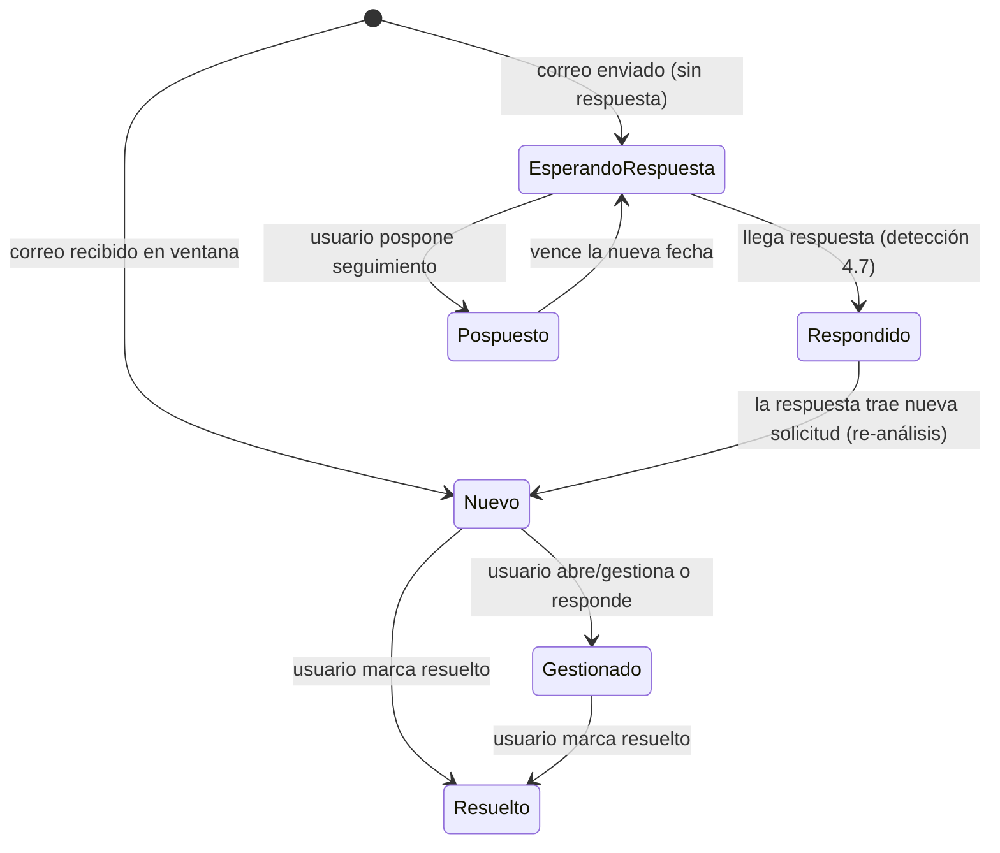

# Propuesta funcional — Correo Ejecutivo v2

_Documento de diseño funcional para revisión del equipo, julio 2026. Responde a la sugerencia
de proceso de correo electrónico recibida (consulta semanal, clasificación
Inbox/Critical/Pending/Follow-up, resúmenes automáticos, generación de respuestas, seguimiento
y detección de respuestas, búsqueda y filtros). No es un documento técnico de implementación:
describe CÓMO debería funcionar, resuelve las inconsistencias lógicas de la sugerencia
original, y deja explícitas las decisiones que el equipo debe tomar antes de construir._

---

## 1. Resumen ejecutivo

La sugerencia es **conceptualmente correcta y deseable**: convierte el dashboard de correo
actual (indicadores + lista del día) en un verdadero centro de gestión con estado por correo,
resúmenes accionables, borradores gestionables sin salir del dashboard y seguimiento
automático.

Aproximadamente el **60% de las capacidades ya existen** en la plataforma (triage con IA,
resúmenes de hilos, borradores con tono/estilo/firma personalizados, seguimiento manual,
aprobación humana obligatoria para todo envío) — pero varias viven en el **chat**, no en el
**dashboard**. Lo genuinamente nuevo es: memoria de estado por hilo de correo, procesamiento
incremental, ciclo completo de borradores en el dashboard, detección automática de
seguimientos y respuestas, y buscador con filtros.

La sugerencia tal como está redactada tiene **tres problemas lógicos** que esta propuesta
corrige (sección 3): categorías que se solapan, una cadencia semanal que contradice la
detección de correos críticos, y un costo/latencia de IA no contemplado que exige un almacén
de estado con procesamiento incremental.

---

## 2. Qué existe hoy vs. qué pide la sugerencia

| Capacidad pedida | ¿Existe hoy? | Dónde |
|---|---|---|
| Lectura de bandeja con prioridad IA (CRÍTICO/ALTO/MEDIO/BAJO) | ✅ Sí, solo correos de HOY | Dashboard (Bandeja) |
| Indicadores Bandeja / Críticos / Pendientes / Seguimiento | ✅ Sí (Pendientes = "no leídos", no "requiere decisión") | Dashboard |
| Resumen por correo (de qué trata, qué piden, qué hacer, fecha límite) | ⚠️ Solo en el chat, bajo demanda | Chat |
| Clasificación persistente que se actualiza con respuestas/gestión | ❌ No — no hay estado por hilo | — |
| Generación de borrador (idioma, tono, estilo personal, firma) | ✅ Sí, con aprobación humana | Chat |
| Editar / regenerar / acortar / formalizar / cambiar idioma un borrador | ⚠️ Por conversación en el chat; sin controles dedicados | Chat |
| Aprobar y enviar con control humano | ✅ Sí — verificado en servidor, auditado | Chat |
| Seguimiento de enviados sin respuesta | ⚠️ Solo correos marcados manualmente ("haz seguimiento a este correo") | Dashboard + chat |
| Generar/regenerar borrador de seguimiento | ✅ Sí | Dashboard |
| Posponer / marcar resuelto / editar / enviar el seguimiento | ❌ No | — |
| Detección de respuestas (salir de Follow-up, reclasificar) | ❌ No | — |
| Búsqueda por remitente/asunto/fecha/etc. | ⚠️ El motor existe (sintaxis Gmail); sin interfaz en dashboard | Chat |
| Lectura de enviados + recibidos en una ventana amplia | ❌ Hoy solo bandeja de entrada del día | — |

---

## 3. Problemas lógicos de la sugerencia original y cómo se corrigen

### 3.1 Las cuatro categorías mezclan tres ejes distintos

Inbox / Critical / Pending / Follow-up **no son categorías del mismo tipo** y por tanto no
pueden ser mutuamente excluyentes:

- **Critical** es un nivel de **prioridad** (¿qué tan urgente es?).
- **Pending** es un **estado de gestión** (¿el ejecutivo debe hacer algo?).
- **Follow-up** es una **dirección** (correo *enviado* por el ejecutivo, esperando respuesta).
- **Inbox** es la ausencia de gestión (todavía no se ha hecho nada con él).

Un correo del regulador pidiendo una decisión antes del viernes es **Critical y Pending a la
vez**. Si se fuerza una sola categoría, o se pierde la urgencia o se pierde la acción.

**Corrección propuesta — modelo de facetas.** Cada hilo de correo mantiene atributos
independientes:

| Faceta | Valores | Significado |
|---|---|---|
| `prioridad` | CRÍTICO / ALTO / MEDIO / BAJO | Urgencia e impacto (la IA la asigna, el usuario puede corregirla) |
| `requiere_accion` | sí/no + tipo (responder / aprobar / decidir / informativo) | ¿El ejecutivo debe hacer algo? |
| `esperando_respuesta` | sí/no | Correo enviado por el ejecutivo sin respuesta del destinatario |
| `estado_gestion` | nuevo / gestionado / resuelto / pospuesto | Ciclo de vida manejado por el usuario y el sistema |

Las **cuatro pestañas de la interfaz se mantienen** (son familiares y útiles), pero pasan a
ser **vistas calculadas** sobre las facetas:

- **Inbox** = recibidos con `estado_gestion = nuevo`.
- **Critical** = `prioridad = CRÍTICO` y no resuelto.
- **Pending** = `requiere_accion = sí` y no resuelto.
- **Follow-up** = enviados con `esperando_respuesta = sí`.

Un correo crítico que requiere decisión aparece en **ambas** vistas (Critical y Pending) con
un badge doble — la alternativa (precedencia estricta Critical > Pending) se deja como
**pregunta abierta** para el equipo (sección 7).

### 3.2 "Semanal" como cadencia operativa se contradice con "atención inmediata"

Si el sistema escanea una vez por semana, un correo **Critical** puede pasar hasta 6 días sin
aparecer en el dashboard — incompatible con la propia definición de Critical ("atención
inmediata"). Además, un job semanal requiere infraestructura de programación (Cloud Scheduler)
que hoy **no está habilitada** en el proyecto.

**Corrección propuesta — dos interpretaciones posibles (DECISIÓN ABIERTA):**

| | Opción A — Escaneo al abrir/refrescar (recomendada) | Opción B — Job semanal literal |
|---|---|---|
| Funcionamiento | Cada vez que el ejecutivo abre o actualiza el dashboard, el sistema procesa incrementalmente los correos nuevos de una **ventana móvil de 7 días** (configurable) | Un proceso corre una vez por semana y procesa todo el período |
| Corr. críticos | Se detectan en el momento en que el usuario consulta | Pueden esperar hasta 6 días |
| Infraestructura nueva | Ninguna | Cloud Scheduler + job dedicado |
| "Semanal" | Se cumple como *ventana de análisis* (últimos 7 días siempre visibles) | Se cumple como *frecuencia de ejecución* |
| Complemento futuro | Un **digest semanal por correo** (resumen de la semana) puede añadirse después como reporte, sin cambiar el modelo | — |

La recomendación técnica es la Opción A: cumple el espíritu de "semanal (inicial)" —ver la
semana completa— sin el hueco de detección ni infraestructura nueva, y deja el digest
programado como evolución natural.

### 3.3 El costo y la latencia de la IA exigen memoria de estado

Resumir y clasificar 50–200 hilos con IA **en cada carga del dashboard** sería lento
(decenas de segundos) y costoso, y además impediría cumplir el requisito de que "la
clasificación se actualice cuando llegue una respuesta" (no hay contra qué comparar).

**Corrección propuesta — estado persistente por hilo + procesamiento incremental.** El
sistema guarda, por cada hilo analizado: el resumen, la solicitud detectada, la acción
sugerida, la fecha límite, la prioridad, las facetas y **cuál fue el último mensaje
analizado**. En cada escaneo:

1. Se listan los hilos de la ventana (recibidos + enviados).
2. Los hilos **sin mensajes nuevos** se sirven desde el estado guardado (instantáneo, costo cero).
3. Solo los hilos **nuevos o con mensajes nuevos** pasan por la IA (en lote, como ya se hace
   hoy con la priorización de la bandeja).
4. La llegada de un mensaje nuevo en un hilo es, precisamente, el disparador de las
   transiciones de la sección 4.7 (detección de respuestas).

Con esto, el primer escaneo de la semana procesa decenas de hilos una sola vez; los refrescos
siguientes procesan solo lo que cambió (típicamente 0–10 hilos).

### 3.4 Lo que la sugerencia omite y la plataforma exige: aprobación humana verificable

"Aprobarla y enviarla" desde el dashboard **debe pasar por el mismo control de aprobación
humana que ya protege el envío desde el chat**: cada envío consume una aprobación registrada,
de un solo uso, verificada en el servidor (no en el texto) y auditada. Ningún botón del
dashboard puede enviar directamente sin ese registro. Esto ya existe y se reutiliza — solo hay
que mantener la regla al diseñar los botones.

---

## 4. Diseño funcional propuesto (por sección de la sugerencia)

### 4.1 Consulta de correos

- El sistema analiza **recibidos y enviados** de la cuenta autorizada dentro de la ventana
  configurada (7 días por defecto).
- Cada elemento de la lista muestra: **remitente/destinatario · asunto · fecha · estado
  (facetas) · resumen corto · acción propuesta · fecha límite si existe**.
- El análisis es incremental (sección 3.3); un indicador muestra "analizando N correos
  nuevos…" durante el proceso.

### 4.2 Clasificación

- Modelo de facetas de la sección 3.1; las cuatro pestañas son vistas.
- La IA asigna prioridad y detecta si requiere acción (y de qué tipo) usando la misma rúbrica
  que ya usa el asistente en el chat (remitentes directivos/reguladores, palabras clave de
  urgencia, solicitudes de reunión, hilos desatendidos, boletines).
- **El usuario siempre puede corregir**: cambiar la prioridad, marcar "gestionado" o
  "resuelto" manualmente. La corrección del usuario prevalece sobre la IA en escaneos
  posteriores.

Transiciones de estado:

### 4.3 Resumen automático

- Por hilo (no por mensaje suelto), considerando **el hilo completo**: de qué trata, qué
  solicita el remitente, qué debe hacer el ejecutivo, fecha límite detectada.
- Se genera una vez y se actualiza solo cuando el hilo recibe mensajes nuevos (incremental).
- El resumen alimenta tanto la tarjeta del dashboard como el contexto del borrador (4.4).

### 4.4 Generación de respuesta

- Desde la tarjeta de un correo, el ejecutivo elige la **acción** (responder aceptando,
  declinando, pidiendo más información, delegando, u objetivo libre en una línea) y el
  sistema genera el borrador usando: contenido del correo + historial del hilo + **idioma del
  remitente** + **estilo de escritura activo del ejecutivo** + **firma activa** (ambos ya
  existentes en la plataforma).
- El borrador queda **siempre en revisión**; nunca se envía automáticamente.

### 4.5 Acciones sobre el borrador

Botones sobre el borrador generado:

| Acción | Comportamiento |
|---|---|
| **Editar** | Editor inline; el texto editado es el que se envía (el sistema actualiza el borrador real en Gmail) |
| **Regenerar** | Nueva versión con la misma instrucción |
| **Más corto** / **Más formal** | Regeneración con el modificador aplicado |
| **Cambiar idioma** | Regenera en ES/EN |
| **Descartar** | Elimina el borrador |
| **Aprobar y enviar** | Crea la solicitud de aprobación → el usuario confirma → el servidor verifica la aprobación registrada y envía → queda auditado. Idéntico modelo de seguridad que el chat |

### 4.6 Seguimiento de correos enviados (automático)

- Además del seguimiento manual actual ("haz seguimiento a este correo"), el escaneo
  identifica **automáticamente** los enviados cuyo hilo no tiene respuesta del destinatario
  pasado el plazo configurable (hoy: 3 días, ya parametrizado en la plataforma).
- Cada elemento de Follow-up muestra: destinatario · asunto · fecha del último envío ·
  **días sin respuesta** · borrador de seguimiento (generado bajo demanda, como hoy).
- Acciones: **Regenerar** · **Editar** · **Posponer** (elegir nueva fecha; sale de la vista
  hasta entonces) · **Marcar resuelto** (ya no requiere seguimiento) · **Aprobar y enviar**
  (mismo control de aprobación de 4.5).

### 4.7 Detección de respuestas

Al escanear, si un hilo en Follow-up tiene un mensaje nuevo del destinatario:

1. Sale de Follow-up y su estado pasa a "respondido".
2. El mensaje nuevo se re-analiza: si contiene una nueva solicitud, el hilo vuelve a
   clasificarse (Pending, y Critical si la urgencia lo amerita), con resumen actualizado.
3. Si el ejecutivo respondió un correo (desde el dashboard, el chat o directamente en Gmail),
   el hilo recibido correspondiente pasa a "gestionado" — la detección funciona aunque la
   gestión ocurra fuera de la aplicación.

> Nota: en esta fase la detección ocurre **al escanear** (al abrir/refrescar). La detección
> en tiempo real (notificaciones push de Gmail) es una evolución posterior que requiere
> infraestructura adicional ya identificada en el roadmap.

### 4.8 Búsqueda y filtros

- Barra de búsqueda en el dashboard: por remitente, destinatario, asunto, palabra clave y
  rango de fechas (el motor de búsqueda de Gmail ya soportado por la plataforma).
- Filtros combinables por vista (Inbox/Critical/Pending/Follow-up), prioridad y estado de
  gestión.
- Los resultados de búsqueda muestran el estado guardado si el hilo ya fue analizado.

---

## 5. Consideraciones transversales

- **Aprobación humana y auditoría**: todo envío (respuesta o seguimiento) exige aprobación
  registrada de un solo uso verificada en servidor, y queda en la traza de auditoría — igual
  que hoy. Sin excepciones.
- **Privacidad**: solo la cuenta Gmail autorizada por el propio ejecutivo; el contenido de
  correos no se indexa a la base de conocimiento corporativa ni se comparte entre usuarios;
  los resúmenes/estados guardados son por usuario.
- **Idiomas**: toda la funcionalidad opera en ES/EN; el idioma del borrador sigue al
  remitente por defecto, con opción de cambio (4.5).
- **Cuotas y costos**: el procesamiento incremental acota las llamadas a IA (primer escaneo
  de la ventana: decenas de hilos; refrescos: solo lo nuevo). Los límites de la API de Gmail
  se respetan con topes por escaneo.
- **Datos nuevos**: se crea una colección de estado por hilo (por usuario). Requiere sus
  índices de consulta correspondientes — con verificación explícita del campo de ordenamiento
  (la plataforma ya sufrió índices desalineados que fallaban en silencio).
- **Fuera de alcance explícito**: envío automático sin aprobación; notificaciones push en
  tiempo real (fase 3); integración Outlook (sin construir en la plataforma); acciones
  masivas (archivar/etiquetar en lote).

---

## 6. Fases sugeridas

| Fase | Contenido | Valor | Esfuerzo estimado |
|---|---|---|---|
| **Fase 1** | Estado por hilo + escaneo incremental (ventana 7 días, recibidos+enviados) + facetas/4 vistas + resúmenes y acción sugerida + follow-up automático + detección de respuestas al escanear + posponer/resolver | El dashboard pasa de "lista del día" a centro de gestión completo | ~1.5–2 semanas |
| **Fase 2** | Ciclo de borradores en dashboard (generar por acción, editar, regenerar, corto/formal/idioma, aprobar-enviar con HITL) + búsqueda y filtros | Gestión de correo sin salir del dashboard | ~1–1.5 semanas |
| **Fase 3** | Detección push en tiempo real (Gmail watch + Pub/Sub) + digest semanal programado (requiere habilitar Cloud Scheduler) | Proactividad real; el spec "semanal" como reporte | ~1 semana + decisión de infraestructura |

---

## 7. Preguntas abiertas para el equipo

1. **Cadencia (sección 3.2)**: ¿Opción A (escaneo incremental al abrir/refrescar, ventana de
   7 días — recomendada) u Opción B (job semanal literal)?
2. **Solapamiento Critical/Pending**: ¿un correo crítico que requiere decisión aparece en
   ambas vistas (con badge doble), o se define precedencia estricta (solo en Critical)?
3. **Ventana de análisis**: ¿7 días es el valor inicial correcto? ¿Quién puede cambiarla
   (cada ejecutivo / administración)?
4. **Plazo de seguimiento**: hoy 3 días. ¿Se mantiene como valor global o se hace
   configurable por ejecutivo (o por correo al enviarlo)?
5. **Correcciones del usuario vs. IA**: cuando el ejecutivo corrige una prioridad, ¿la IA
   puede volver a subirla si llegan mensajes nuevos urgentes al hilo, o la corrección manual
   es definitiva para ese hilo?
6. **Digest semanal (fase 3)**: ¿entregado por correo, dentro de la app, o ambos?
